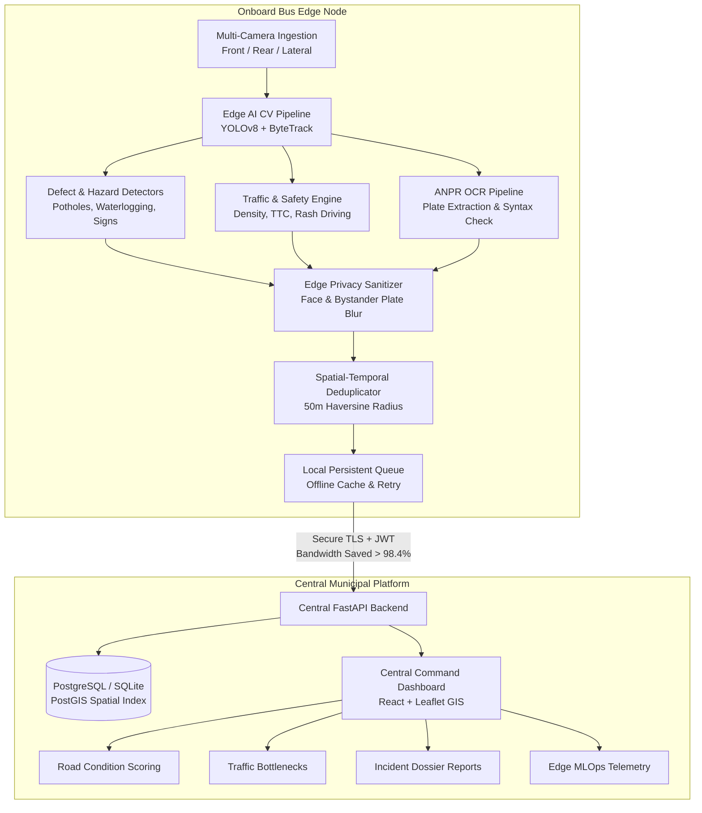

# AI-Powered Mobile Urban Intelligence Platform Using Public Transport Buses

> **Smart India Hackathon (SIH) Solution**  
> An autonomous edge + cloud platform that transforms public transport bus fleets into mobile urban sensing units for road defect detection, traffic flow monitoring, pedestrian safety, and incident intelligence.

[](https://github.com/urban-intelligence/platform)
[](https://fastapi.tiangolo.com)
[](https://react.dev)
[](https://www.typescriptlang.org)
[](https://www.docker.com)
[](LICENSE)

---

## 1. Problem Background & Objective

Municipal and transport authorities across modern cities depend heavily on fixed CCTV cameras, manual periodic surveys, and delayed citizen complaints to detect damaged infrastructure and safety hazards. This results in slow emergency dispatch, poor maintenance planning, and incomplete situational awareness.

**The Solution:**  
Public transport buses traverse almost every major urban corridor every day. By equipping bus camera feeds (front, rear, lateral, interior) with **onboard edge AI computing units**, public buses become **mobile urban sensing nodes**. Video streams are analyzed locally in real time, transmitting lightweight event metadata, GPS geotags, and privacy-sanitized evidence to a centralized GIS Command Center.

---

## 2. Platform Architecture



---

## 3. Key Capabilities & Features

1. **Multi-Camera Edge Ingestion**: Accommodates front, rear, left, right, and interior feeds across RTSP streams, video files, live webcams, or synthetic generators.
2. **Road Defect & Degradation Detection**: Detects potholes, alligator cracks, road damage, waterlogging, damaged dividers, and missing traffic signs with area estimation and explainable AI reasons.
3. **Spatial & Temporal Event Deduplication**: Prevents duplicate reports when multiple buses pass the same pothole; Bayesian algorithms reinforce aggregate confidence from multiple independent sightings.
4. **Traffic Intelligence & Congestion Heatmaps**: Real-time multi-class tracking (cars, buses, trucks, motorcycles, auto-rickshaws), flow velocity, and bottleneck discovery.
5. **Vulnerable Road User (VRU) Safety**: Proximity and Time-to-Collision (TTC) calculations for pedestrians and unprotected crossing clusters near school zones.
6. **Reckless Driving & ANPR Extraction**: Flags wrong-way driving, high-speed swerving, and hit-and-run scenarios, extracting valid Indian registration plates (`TS09AB1234`) with syntax verification.
7. **Privacy-Preserving Edge Architecture**: Automatic Gaussian blurring of citizen faces and bystander vehicle plates.
8. **Certified Municipal Incident Reports**: Exportable and printable PDF dossiers with chain of custody and authority verification blocks.
9. **Simulation Suite for Demonstration**: High-fidelity demonstration mode simulating 10 buses moving through Hyderabad corridors with one-click SIH judging scenario triggers.

---

## 4. Quick Start: Running Locally

### Prerequisites
- Python 3.11+
- Node.js 20+ & npm

### Backend Setup
```bash
cd backend
python -m venv .venv
.venv\Scripts\activate          # Windows (source .venv/bin/activate on Linux/Mac)
pip install -r requirements.txt
uvicorn app.main:app --reload --port 8000
```
- Interactive Swagger API: `http://localhost:8000/docs`
- Redoc API Reference: `http://localhost:8000/redoc`

### Frontend Command Center Setup
```bash
cd frontend
npm install
npm run dev
```
- Command Center Interface: `http://localhost:5173`

### Running the Bus Fleet Simulator
```bash
# In a separate terminal
python simulator/run_simulation.py http://localhost:8000
```

---

## 5. Running via Docker Compose

Launch the complete microservice platform (PostgreSQL + PostGIS, FastAPI Backend, React/Nginx Frontend, and Fleet Simulator) with a single command:
```bash
docker-compose up --build
```
- Frontend Command Center: `http://localhost:3000`
- Central Backend API: `http://localhost:8000`

---

## 6. Running the Test Suite

Run the full automated test suite covering edge processors, deduplication, simulator, and API integration:
```bash
# From workspace root
& .\backend\.venv\Scripts\pytest.exe tests/ -v
```

---

## 7. SIH Evaluation Demonstration Flow

For judging presentations, refer to the detailed walkthrough guide in [docs/DEMO_GUIDE.md](docs/DEMO_GUIDE.md).

Use the top-right **`DEMO SCENARIOS`** dropdown on the command center header to sequentially demonstrate:
1. **Bus 12** detects a deep pothole on Nampally Main Road (92% confidence).
2. **Bus 7** traverses the same road and corroborates the sighting (deduplication merges cluster, confidence reaches 95%).
3. **Traffic Bottleneck** at Mehdipatnam Junction triggers congestion alerts.
4. **Severe Waterlogging** detected on Charminar Bus Corridor.
5. **School Zone VRU Alert** near Ameerpet Education Hub (TTC 2.1s).
6. **Begumpet Hit-and-Run**: Offending vehicle collision detected, plate `TS09AB1234` extracted with 91% confidence.
7. Open **Incident Reports** to print the formal certified municipal dossier.

---

## 8. License

This project is licensed under the MIT License - see the [LICENSE](LICENSE) file for details.

## Data provenance and current limitations

Copy `frontend/.env.example` to `frontend/.env` before local startup. Set
`VITE_API_BASE_URL` to your backend API URL (including `/api`). Without it,
the frontend requests same-origin `/api`; hosting must proxy this path.
Set `VITE_DEMO_MODE=true` explicitly to use the standalone demonstration.
Restart Vite after changing these values; production builds embed them.

Backend mode does not substitute mock collections on errors or empty results,
and does not randomly move buses. Backend seed/simulator records and some
analytical panels remain illustrative; this is not a validated live deployment.
Road detections currently operate per frame. Hit-and-run rules require explicit
collision and departure confirmations from the caller; the confidence value 0.0
means uncalibrated, not a measured probability. No component supplying these
confirmations is implemented by this change. Real-video validation remains needed.
